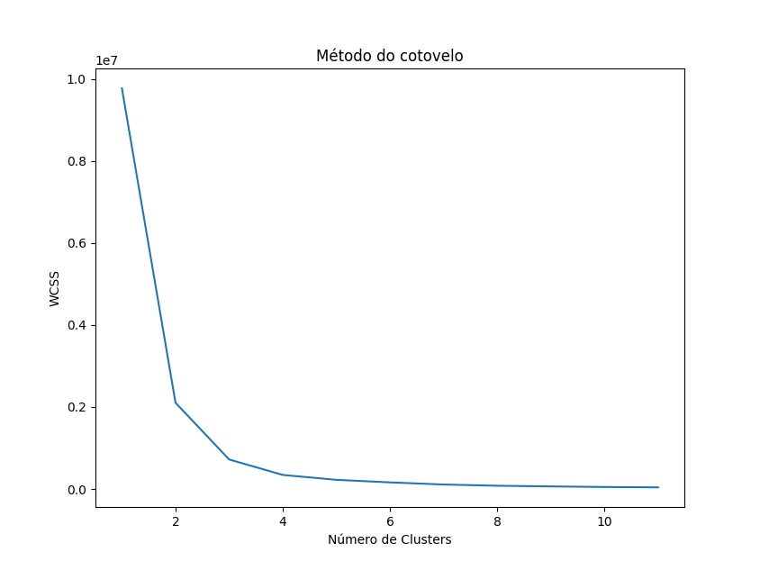
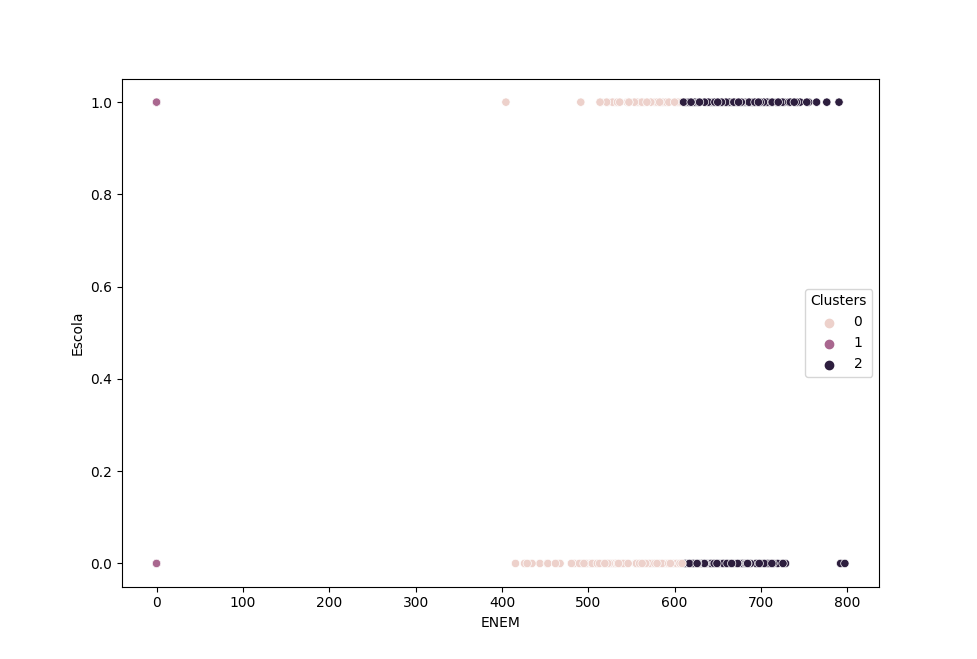

<h2 align="center">
        
<a href="https://drive.google.com/file/d/1vpBgtOVsp1PiTDzKac46wmbW_4RbeOzm/view?usp=sharing">
         
</a>
 
 
<a href="">
         
</a>
       <a href="https://www.linkedin.com/in/matheusfbonfim/">
         
       </a>     
</h2>


<h1 align="center">
    
</h1>

<h1 align="center">
   Aprendizado Não Supervisionado - Clustering 
<h2 align="center">
   K-MEANS
</h2>
</h1>

<!--INDEX-->
<p align="center">
  <a href="#-sobre-o-projeto">Sobre o projeto</a>&nbsp;&nbsp;&nbsp;|&nbsp;&nbsp;&nbsp;
  <a href="#-Desenvolvimento">Desenvolvimento</a>&nbsp;&nbsp;&nbsp;|&nbsp;&nbsp;&nbsp;
  <a href="#-método-elbow-e-Kmeans">Resultados</a>&nbsp;&nbsp;&nbsp;|&nbsp;&nbsp;&nbsp;
  <a href="#rocket-tecnologias">Tecnologias</a>&nbsp;&nbsp;&nbsp;|&nbsp;&nbsp;&nbsp;
  <a href="#-tools">Tools</a>&nbsp;&nbsp;&nbsp;|&nbsp;&nbsp;&nbsp;
  <a href="#-como-executar-o-projeto">Executar projeto</a>&nbsp;&nbsp;&nbsp;|&nbsp;&nbsp;&nbsp;
  <a href="#memo-license">License</a>
</p>


## 💻 Sobre o projeto

- Projeto desenvolvido na matéria de Sistemas Inteligentes, durante o curso de Engenharia da Computação - **[@UTFPR](http://www.utfpr.edu.br/)**.
- A proposta do presente trabalho tem como objetivo demonstrar a aplicação de clustering sobre uma base de dados, empregado o Kmédias (Kmeans).
- O clustering é aplicado na base "alunos_engcomp" no qual foi retirada diretamente do sistema acadêmico e conta com os campos Sexo, Coeficiente, Nota no ENEM, Período e Escola (Pública ou Particular).
- A base é pré-processada antes da aplicação do método**Kmeans.**
- É utilizado o método Elbow (método do cotovelo) para justificar a quantidade de agrupamentos

## 🔖 Desenvolvimento

No link abaixo do [**Google Drive**](https://drive.google.com/file/d/1vpBgtOVsp1PiTDzKac46wmbW_4RbeOzm/view?usp=sharing) é possível fazer o download de um relatório no qual foi desenvolvido com objetivo de descrever sobre o desenvolvimento da implementacão da clusterização sobre esta base de dados, assim como demonstrar os resultados e discussões obtidos e por fim uma conclusão:

[](https://drive.google.com/file/d/1vpBgtOVsp1PiTDzKac46wmbW_4RbeOzm/view?usp=sharing)

## ✨ Método Elbow e Kmeans

<h1 align="center">
    
</h1>

<h1 align="center">
    
</h1>

## :rocket: Tecnologias

This project was developed with the following technologies:

- [scikit-learn](https://scikit-learn.org/stable/)
- [pandas](https://pandas.pydata.org/)
- [numpy](https://numpy.org/)

## ⛏ Tools
- [Visual Studio Code](https://code.visualstudio.com/)

## 🚀 Como executar o projeto

   ```
   - Clone this repository:
   $ git clone https://github.com/matheusfbonfim/UnsupervisedLearning-KMeans-Clustering

   - Enter in directory:
   $ cd src

   - Execute application:
   $ python main.py
   ```

## :memo: License

O projeto está sobre a licença [MIT](./LICENSE) ❤️ 

Gostou? Deixe uma estrelinha para ajudar o projeto ⭐

<!-- Mensagem final -->
<h3 align="center">
Feito com ❤️ por <a href="https://www.linkedin.com/in/matheusfbonfim/">Matheus Bonfim</a>
<br><br>
</h3>


